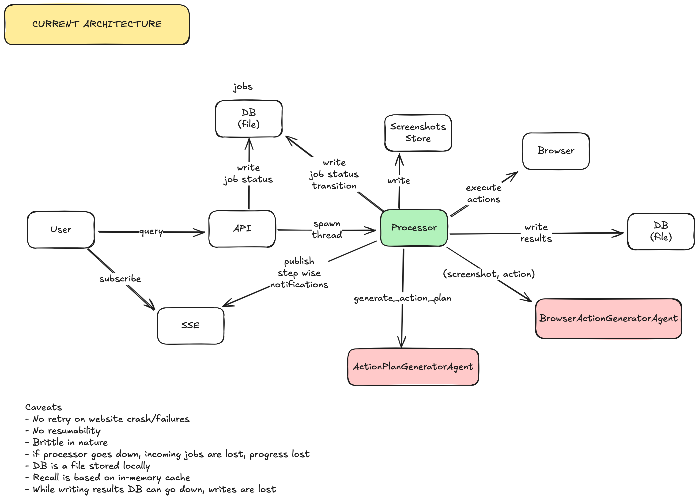

# Demo

https://www.youtube.com/watch?v=Q685CLK73Dc

[](https://www.youtube.com/watch?v=Q685CLK73Dc)

# Browser agent

This is a browser use agent that can take user query in natural language and execute actions on behalf of the user.

## Stack

-   backend: python3, flask, playwright
-   frontend: nextjs
-   llm agents:
    -   gpt-4o-mini (action plan generator),
    -   gpt-4o (vision model, decide browser action)

## Design

### Principles

-   DOM-based crawling & browser control does not work today because

    -   it's fragile since CSS classes & selectors can change on a webapte
    -   It's not resilient to UI changes
    -   Brittle with JS heavy SPA websites

-   The application will be used by non-technical user, they should be able to troubleshoot

-   The application should have a way for human-in-the-loop feedback and decision making

### Low-level

-   This project implements a vision model based browser control agents.
-   In a web-page a user can do following actions - `input`, `click` or `extract data`

-   First, we generate an action plan

```json
{
	"search for green frontier capital yourstory on google and get the headline of the first article": {
		"goto": "https://www.google.com",
		"action_plan": [
			"Open your web browser and go to https://www.google.com.",
			"In the Google search bar, type 'green frontier capital yourstory' and press Enter.",
			"Click on the first article from YourStory to open it.",
			"Read the headline of the article."
		],
		"goal": "The headline of the first article from YourStory about Green Frontier Capital.",
		"query_id": "ebd45c17-99d6-412c-ae3a-35f1231941b7",
		"query": "search for green frontier capital yourstory on google and get the headline of the first article",
		"vision_only": ["Read the headline of the article."]
	}
}
```

-   Using playwright we navigate to the goto url
-   When he page loads, we draw bounding boxes with numbers and then take a screenshot of it
-   We send the screenshot and action plan to the LLM
-   LLM decides the action

```json
{
	"box_click": 1,
	"input_text": "system generated",
	"extracted_data": ""
}
```

-   Action is executed by the program
-   program updates steps_done
-   Loop continues until all steps are done
-   Outside of the loop goal is checked for validation
-   If goal not achieved then restart the loop from the last step

### High-level current



-   Current architecture is created for POC purpost and has following caveats:
    -   No retry on website crash/failures
    -   No resumability
    -   Brittle in nature
    -   if processor goes down, incoming jobs are lost, progress lost
    -   DB is a file stored locally
    -   Recall is based on in-memory cache
    -   While writing results DB can go down, writes are lost

### High-level future


-   **Resiliency**

    -   Temporal workers can retry on worker crash or website crash/error
    -   Temporal workers can resume state
    -   If processor layer (temporal workers) go down, incoming jobs are buffered in kafka
    -   Distributed DB like dynamodb & distributed file store like S3 is used
    -   Recall is built on distributed cache

-   **Scalability**
    -   API nodes, SSE layer, LLM-agents can be scaled using k8 pods horizontal autoscaler
    -   Recall layer, SQL DB (temporal) can be sharded by region
    -   Temporal workers can be used to handle concurrent workload using go routines with a bound
    -   Job status updates are written to DB asynchronously, also buffered
    -   Each worker can have their own re-usable browser instance for parallel query processing
    -   Dynamodb can handle bursty i/o as well as scale out on demand

## How to run it

### backend

```shell
cd backend/
python3 -m venv .venv
source .venv/bin/activate
gunicorn main:app --worker-class gevent --bind 0.0.0.0:8000
```

### frontend

```shell
cd frontend/
npm i
npm run dev
```

## Future extendability

-   **Support parallel browser use queries** - We can use temporal workers to parallelize query processing.
    For notfying user on the progress `sse.publish` supports `channel=query-id`,

## Resiliency

-   **Handle processor crash** - We can delegate the processing workloads to temporal workers, temporal handles
    checkpointing and resumability.

-   **Handle unresponsive pages/browser crash** - We can implement timeout in the workers along in combination with
    a delayed queue using SQS for picking up the same job after some cooldown period.

## Optimisations

-   **Reduce hallucinations** - We can use chain-of-thought prompting and structured outputs to constrain model responses and reduce hallucinations.

-   **Security** - We can implement sandboxed browser environments and rate limiting to prevent malicious use of the browser automation system.

-   **Tracing, caching & feedback** - Currently in this project there is no tracing thus we cannot record feedback & score the output
    Prompt caching is required to control cost. We can use langfuse to implement these in future.

-   **User perceived latency** -
    We can build a recall layer for creating cache of popular user queries so users will feel instant results for popular queries on popular websites, rather than waiting for crawling to finish.

-   **Repository layer** - Decoupple data read/write activities from the service layer to a repository layer, so we can swap out the underlying storage layer in future with minimal code change.

-   **Async logging** - Replace print statements with async json logging that is stanadardised
